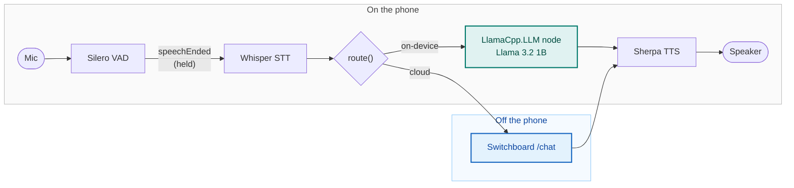

# Hybrid Voice Agent

An iOS voice agent that runs the whole conversation on the device — speech to
text, a small language model, and text to speech — and can hand the "brain" over
to a cloud model when you want it to. Speech recognition and synthesis stay on
the device on both paths, so only the intelligence swaps, and the two share one
transcript.

Built with the [Switchboard SDK](https://switchboard.audio). The on-device voice
pipeline comes from [EdgeSpeech](https://github.com/switchboard-sdk/EdgeSpeech).

> **Status: early.** The on-device speech pipeline runs, both brains sit behind one
> interface, and you can switch between them mid-conversation.

## Architecture

Everything but the cloud brain runs on the phone. Speech recognition and synthesis
are on the device whichever brain answers, so the only thing that ever crosses the
network is the thinking — and only when you ask it to.



Both brains are handed the same transcript on every turn and neither keeps its own,
which is what lets the switch happen mid-conversation rather than starting over.

`route()` in [`src/brains/router.ts`](src/brains/router.ts) is the seam: the only
file in the app that names an implementation, and so the only one a fork has to
change. [Swapping the brain](#swapping-the-brain) is what to do there.

## Requirements

- macOS with Xcode 16 or newer
- Node.js 22+
- A real iPhone — the on-device models need one, and Whisper's Metal path does
  not run in the Simulator
- Around 3 GB of free disk space for the frameworks, and around 800 MB free on
  the phone for the language model

## Setup

```bash
git clone https://github.com/switchboard-sdk/hybrid-voice-agent-sample.git
cd hybrid-voice-agent-sample
npm install                 # downloads ~2.3 GB of Switchboard frameworks, takes a while
npm run ios -- --device     # prebuilds the iOS project, then builds and runs it
```

`npm run ios` on its own targets the Simulator, which is useful for UI work but
not for the models — run on a device for anything real.

`npm install` also copies `.env.example` to `.env`. Fill in your Switchboard app
ID and secret there before running — register at
[console.switchboard.audio](https://console.switchboard.audio/register) to get
them.

No model weights are committed here. Install fetches the SDK and extension
frameworks — which carry the speech models — from the public Switchboard bucket
into `modules/edgespeech-native/ios/Frameworks/`, and strips the assets this app
never reads. The default channel is `develop`, a pre-release one, because the app
needs the LLM node's cancel action and reply ceiling and no release carries them
yet. See [Installing the frameworks](docs/DESIGN.md#installing-the-frameworks)
for the variables that control it and what the lock file can and cannot promise.

## The language model

**Built with Llama.** The on-device model is Meta's Llama 3.2 1B Instruct, used
under the [Llama 3.2 Community License](https://github.com/meta-llama/llama-models/blob/main/models/llama3_2/LICENSE),
which asks for that notice wherever it is used. The download screen carries it too.
[THIRD-PARTY-NOTICES.md](THIRD-PARTY-NOTICES.md) has the full obligation, along
with the share-alike terms on the text-to-speech voice.

The weights are downloaded by the app on first launch rather than shipped inside
it. The first launch shows a screen offering the download and saying what it
costs; it is not started automatically, because 773 MB is not something to spend
on someone's data plan without asking. The fetch runs on a background
`URLSession`, so it survives the app being put away and keeps retrying through a
connection that comes and goes. After that, every launch goes straight to the
conversation with no connection needed.

Two things it does not do. The app being killed mid-download loses the partial
file, so the next launch starts again. And the model sits in Documents, which iOS
includes in the device's backup — `expo-file-system` has no way to mark a file as
excluded, and Documents is the only directory the system will not evict.

Whoever does not want to wait can take **Use the cloud brain instead** and carry
on: speech recognition and synthesis are in the app either way, so only the
thinking moves. The on-device brain is then withdrawn — `route` drops it and the
picker dims it, the same way losing the connection withdraws the cloud. Getting
the model afterwards means relaunching.

| Variable                    | Effect                                                                                                   |
| --------------------------- | -------------------------------------------------------------------------------------------------------- |
| `EXPO_PUBLIC_LLM_MODEL_URL` | Where to fetch the model from. Defaults to a public mirror of the build the SDK's LLM extension carries. |

Overriding the URL also stands the size check down, since another GGUF will not
weigh what this one does — a short file is then only caught by the total the
server declares.

## Layout

```
App.tsx                     credentials, then the model, then the conversation
index.ts                    Expo entry point
src/
  voice/                    the on-device pipeline
    VoiceEngine.ts          the audio graph and state machine, in TypeScript
    SwitchboardClient.ts    typed wrapper over the SDK's JSON-RPC interface
    EdgeSpeechProvider.tsx  configuration and lifecycle
    hook.ts                 useEdgeSpeech()
  brains/                   the two interchangeable brains
    types.ts                the Brain interface and the AgentProfile it wears
    OnDeviceBrain.ts        the LlamaCpp.LLM node
    CloudBrain.ts           a cloud LLM over HTTP
    router.ts               which brain answers — the file to change
  model/                    the language model's weights
    download.ts             finding it on the phone, and fetching it if it is not
    hook.ts                 useModel()
  screens/                  UI
    ConversationScreen.tsx  the whole app: transcript, state, per-turn badges
    ModelDownloadScreen.tsx the first launch: the download, or a way past it
    PromptScreen.tsx        typing the agent's brief
    SetupScreen.tsx         what a clone with no credentials sees
  connectivity.ts           whether there is a connection, and the spoken notice
  errors.ts                 the only place a failure code becomes a sentence
  profiles.ts               the agent profiles, and which one this build wears
modules/edgespeech-native/  the only native code: a C++ TurboModule + podspec
app.config.js               layers the signing team from .env onto app.json
frameworks.lock.json        the SDK builds this commit was tested against
scripts/fetch-frameworks.js the framework download, and the asset stripping
scripts/postinstall.js      runs the fetch after npm install
scripts/testflight.js       archive, export and upload a build
docs/DESIGN.md              how the pipeline, prompts and brains work underneath
docs/TESTFLIGHT.md          distributing a build
```

The native layer is deliberately tiny: one JSON-RPC string channel plus an event
stream. The whole audio graph — voice detection, transcription, synthesis,
barge-in — is authored in TypeScript above it, so changing the pipeline never
means touching native code. See [The native layer](docs/DESIGN.md#the-native-layer).

## Swapping the brain

Both answerers implement one interface:

```ts
interface Brain {
  readonly id: BrainId
  readonly label: string
  readonly requiresNetwork: boolean
  readonly requiresModel: boolean
  reply(
    transcript: string,
    history: ConversationMessage[],
    signal?: AbortSignal
  ): Promise<BrainReply>
  applyProfile(profile: AgentProfile): void
  reset(): void
}
```

Neither owns the conversation — the transcript is handed in on every turn — so a
reply comes back saying which brain produced it and how long it took, and a switch
mid-conversation carries the context across.

`src/brains/router.ts` is the only file that names the implementations. Everything
else talks to the `Brain` interface and never learns which one it got, so a fork
changes that one file:

```ts
export const brains: readonly Brain[] = [onDeviceBrain, cloudBrain]

export function route(preferred: BrainId): Brain {
  return brains.find((brain) => brain.id === preferred) ?? onDeviceBrain
}
```

Adding a third brain means writing a class that implements `Brain`, constructing it
there, and adding it to `brains` — the picker in the UI is rendered from that list,
so it appears on its own. Routing on something other than the user's choice means
changing `route`, which is handed the selection and can consult whatever it likes
instead.

[The two brains](docs/DESIGN.md#the-two-brains) covers what each implementation
does beyond the interface, and
[Conversation history](docs/DESIGN.md#conversation-history) covers how the
on-device node's own context is kept in step with the transcript.

## Agent profiles

The app is not tied to one business. Everything that is — the heading, the two
system prompts, what a refusal sounds like, and the examples on the empty screen
— lives in an `AgentProfile` in [`src/profiles.ts`](src/profiles.ts). Two ship:
`travel` and `telco`.

White-labelling means adding one there and naming its id:

```
EXPO_PUBLIC_AGENT_PROFILE=telco
```

No other file changes. An unknown id warns and falls back rather than shipping a
build with no agent at all.

### Typing one instead

**Edit prompt** in the header opens a field for the agent's brief — what it is and
who it is speaking to. That is the part a user types; the rules for a spoken reply
are added around it, and the screen shows both assembled prompts so nothing is
hidden. The brief is saved to the Documents directory, so it survives a relaunch.

The typed text is not used verbatim, and that is deliberate in two ways:

- **It cannot go to both brains as written.** The on-device set has to say it is
  offline and cannot look anything up; a cloud model given that line announces it
  on every turn. So each brain's prompt is composed separately.
- **A brief with no rules produces a bad agent at 1B.** Without the brevity rule
  the model answers a broad question with a list, which the code then throws away
  after the first sentence — nine seconds of waiting for one sentence that was
  ready in about one.

What a typed brief gives up is sharpness. Its rules are general, so they cannot
name the particular things this agent must not invent, the way the written profiles
name a fare or a data allowance. A profile in `src/profiles.ts` is the better
answer for anything you ship; typing one is for trying an idea without a rebuild.

Saving an empty field clears the typed agent and goes back to a built-in one.

### Switching

The header also cycles between the profiles that exist. **Switching resets
everything** — the transcript, the badges, the picked brain and both brains' own
state. A profile is a different product rather than a new topic, so there is
nothing worth carrying across, and the screen is simply remounted. Both controls
are refused mid-turn, since tearing the screen down under a reply that is still
arriving would leave the mic open and the old agent talking over the new one.

Two things to know before writing one:

- **The two prompts must stay separate.** One prompt for both models is the bug it
  looks like a saving: the on-device set opens by saying it is offline, and a cloud
  model given that line announces it on every turn.
- **The on-device rules are tuned, not generic.** What carries over to a new domain
  is the shape — instructions rather than descriptions, refuse and redirect in one
  sentence, a worked example per rule. The rules themselves still want a pass on a
  real phone. [The persona](docs/DESIGN.md#the-persona) explains why each of those
  holds.

The refusal wordings live in the profile for the same reason: `OnDeviceBrain` says
one in code rather than asking the prompt for it, so a sentence left over from
another domain would contradict the prompt it shipped with.

## Cloud credentials

There are none to add to `.env`. The cloud brain does not call a provider
directly: it posts to Switchboard's `/chat`, which authenticates with the same app
ID and secret that start the SDK and keeps the provider key on the server. No
credential worth stealing is compiled into the bundle — which matters because
`EXPO_PUBLIC_` variables can be extracted from any build that ships.

What does have to be set is a provider key on the app record, which lives in the
console rather than in this repo. Open your app in
[console.switchboard.audio](https://console.switchboard.audio/), find
**Configuration**, and add an OpenAI key to the JSON already shown there:

```json
{ "openAi": { "apiKey": "sk-proj-…" } }
```

The editor replaces the whole config, so merge rather than paste over it. The same
key serves the Realtime client-secret routes, so an app already set up for those
needs nothing further. Until it is saved, a cloud turn fails with _"This app has no
cloud model configured"_ and the on-device brain carries on regardless.

The endpoint decides the rest, and none of it is per-request: which model answers,
a 200-token ceiling, and the last 12 messages of whatever is sent. It is also rate
limited to five requests per 30 seconds per app — one turn is one request — and a
refused turn still counts against the window. So a 429 is not retried:
`CloudBrain` reports how long to wait and offers the on-device brain.

| Variable                         | Effect                                                                         |
| -------------------------------- | ------------------------------------------------------------------------------ |
| `EXPO_PUBLIC_CLOUD_LLM_BASE_URL` | Where the cloud brain posts. Defaults to `https://api.switchboard.audio/chat`. |

## Known limits

**The model on the phone invents specifics, confidently, and nothing here stops it.**
The prompt forbids exactly that; it breaks the rules anyway. Asked how far something
is it gives a walking time. Asked about a place it has no knowledge of it describes
one, and will put a town several hundred kilometres from where it belongs. Asked
nothing at all — a "thanks" at the end of a conversation — it may decide where the
user is standing and what they are about to do. The examples are from the travel
profile; the behaviour is the model's, so expect it whatever profile you write.

Rewording the rules does not reach it, and neither does sampling at temperature 0.
A code guard could catch the figures, since a price or a distance is detectable
without understanding it, but not the invented places: refusing every place the
traveller did not name first leaves the brain unable to answer the questions people
actually ask.

So it stands as the honest limit of a 1B model with no retrieval behind it, and the
cloud brain is one tap away for anything that needs a fact. The replies are fluent
and sound authoritative, which is exactly what makes them a problem — worth knowing
before showing this to anyone.

**Recognition is the other one.** `ggml-base.en` is weak on proper nouns, which is
the one class of word a travel assistant hears most: "Budapest" comes back as
"Buddha Pasht" often enough to plan around. Nothing downstream questions a mangled
name, so one misrecognition becomes the premise for the rest of the conversation —
the model answers about the wrong city and never wonders why.

## Development

```bash
npm run lint      # eslint
npm run check     # tsc --noEmit
npm test          # jest
npm run format    # prettier
```

All three checks run on every pull request.

## Further reading

- [docs/DESIGN.md](docs/DESIGN.md) — the native layer, framework install and asset
  stripping, the screen, turn taking, the prompts, both brain implementations,
  going offline, error handling, and conversation history.
- [docs/TESTFLIGHT.md](docs/TESTFLIGHT.md) — signing, `npm run testflight`, and
  what has to exist in App Store Connect first.

## Licence

MIT — see [LICENSE](LICENSE). Third-party components, including the Llama 3.2
attribution requirement and the share-alike licence on the text-to-speech voice,
are listed in [THIRD-PARTY-NOTICES.md](THIRD-PARTY-NOTICES.md). Read that file
before forking.
