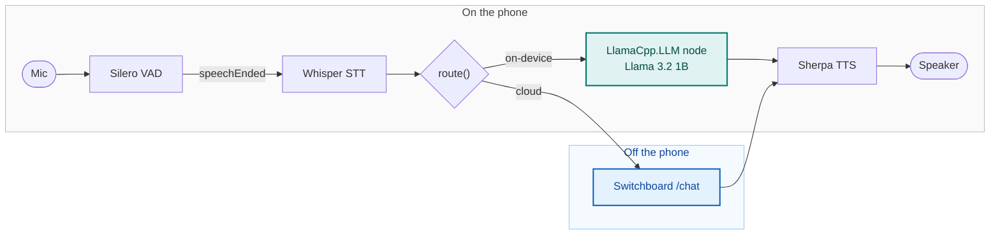
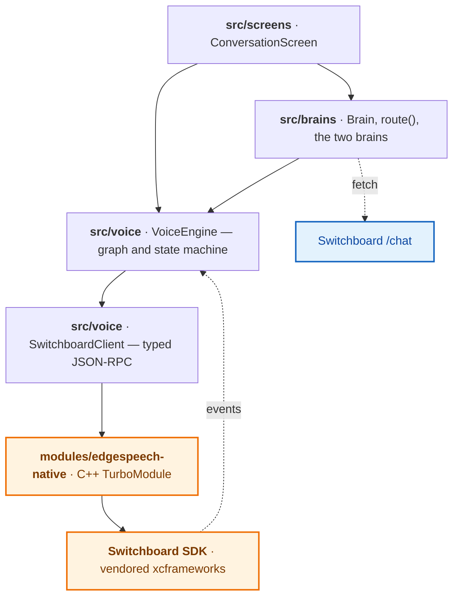

# Hybrid Voice Agent

An iOS voice agent that runs the whole conversation on the device — speech to
text, a small language model, and text to speech — and can hand the "brain" over
to a cloud model when you want it to. Speech recognition and synthesis stay on
the device on both paths, so only the intelligence swaps, and the two share one
transcript.

Built with the [Switchboard SDK](https://switchboard.audio). The on-device voice
pipeline comes from [EdgeSpeech](https://github.com/switchboard-sdk/EdgeSpeech).

> **Status: early.** The on-device speech pipeline runs, both brains sit behind one
> interface, and you can switch between them mid-conversation.

## Architecture

Everything but the cloud brain runs on the phone. Speech recognition and synthesis
are on the device whichever brain answers, so the only thing that ever crosses the
network is the thinking — and only when you ask it to.



Both brains are handed the same transcript on every turn and neither keeps its own,
which is what lets the switch happen mid-conversation rather than starting over.

`route()` in [`src/brains/router.ts`](src/brains/router.ts) is the seam: the only
file in the app that names an implementation, and so the only one a fork has to
change. [Swapping the brain](#swapping-the-brain) is what to do there,
[The two brains](#the-two-brains) is the interface a new one implements, and
[Conversation history](#conversation-history) is how the on-device node's own
context is kept in step with that transcript.

## Requirements

- macOS with Xcode 16 or newer
- Node.js 22+
- A real iPhone — the on-device models need one, and Whisper's Metal path does
  not run in the Simulator
- Around 3 GB of free disk space for the frameworks, and around 800 MB free on
  the phone for the language model

## Setup

```bash
git clone <repo-url>
cd hybrid-voice-agent-sample
npm install                 # downloads ~2.3 GB of Switchboard frameworks, takes a while
npm run ios -- --device     # prebuilds the iOS project, then builds and runs it
```

`npm run ios` on its own targets the Simulator, which is useful for UI work but
not for the models — run on a device for anything real.

`npm install` also copies `.env.example` to `.env`. Fill in your Switchboard app
ID and secret there before running — register at
[console.switchboard.audio](https://console.switchboard.audio/register) to get
them.

No model weights are committed here. Install fetches the SDK and extension
frameworks — which carry the speech models — from the public Switchboard bucket
into `modules/edgespeech-native/ios/Frameworks/`. The language model is not among
them: see [The language model](#the-language-model) below.

The fetch itself lives in `scripts/fetch-frameworks.js`, which `postinstall`
delegates to and you can run on its own with `npm run frameworks`. Each framework
is stamped with the bucket object's ETag once it lands, so a re-run fetches only
what is missing or has changed.

**The default channel is `develop`, a pre-release one.** The app needs the LLM
node's cancel action and its reply ceiling, and no release carries them yet — so
this is not a preference, and it does mean the frameworks can change under a fixed
version. `frameworks.lock.json` records the ETags this commit was tested against;
the stamps cannot, since the frameworks are not in git. When the bucket no longer
serves what the lock says, the fetch prints which packages moved and carries on
rather than stopping — an uninstallable sample is worse than one that tells you
what it is running. `SWITCHBOARD_UPDATE_LOCK=1 npm run frameworks` takes the new
build and refreshes the lock. Pointing `SWITCHBOARD_SDK_CHANNEL` at a release once
one carries those two features is the real fix.

The install script also honours a few build-time variables:

| Variable                  | Effect                                                                    |
| ------------------------- | ------------------------------------------------------------------------- |
| `SWITCHBOARD_SDK_CHANNEL` | Bucket path to pull from. Defaults to `develop`.                          |
| `SWITCHBOARD_SDK_VERSION` | SDK version in the archive names. Defaults to `3.2.6`.                    |
| `SKIP_FRAMEWORK_DOWNLOAD` | Skip the download entirely. Used by CI's lint/typecheck/test job.         |
| `SWITCHBOARD_KEEP_ASSETS` | Keep every asset the packages ship, instead of stripping the unused ones. |
| `SWITCHBOARD_UPDATE_LOCK` | Record what was fetched in `frameworks.lock.json`.                        |

## The language model

**Built with Llama.** The on-device model is Meta's Llama 3.2 1B Instruct, used
under the [Llama 3.2 Community License](https://github.com/meta-llama/llama-models/blob/main/models/llama3_2/LICENSE),
which asks for that notice wherever it is used. The download screen carries it too.
[THIRD-PARTY-NOTICES.md](THIRD-PARTY-NOTICES.md) has the full obligation, along
with the share-alike terms on the text-to-speech voice.

The language model is downloaded by the app on first launch, not shipped inside it.

The LLM extension does ship a Llama 3.2 1B GGUF inside its xcframework, and
CocoaPods embeds a vendored framework whole — so leaving it there puts 773 MB in
the built app and a gigabyte-and-a-half install in front of anyone cloning this
repo. `scripts/fetch-frameworks.js` deletes it straight after extracting, and
`src/model` fetches it to the phone instead.

It does the same to three assets Sherpa ships that this app never reads, listed in
`STRIPPED_ASSETS`. `HLG.fst` and the CTC model belong to `SherpaSTTNode`, and
transcription here is `Whisper.STT`; `de_DE` is a voice nothing selects, since
`ttsVoice` is `en_GB`. That is 471 MB, and it is what takes the built app from
856 MB to around 385 MB. Set `SWITCHBOARD_KEEP_ASSETS` to keep them, which is what
pointing the graph at `Sherpa.STT` or the German voice needs.

The first launch shows a screen offering the download and saying what it costs.
It is not started automatically: 773 MB is not something to spend on someone's
data plan without asking. The fetch runs on a background `URLSession`, so it
survives the app being put away and keeps retrying through a connection that
comes and goes. The file lands in Documents, and every launch after that goes
straight to the conversation with no connection needed.

Two things it does not do. The app being killed mid-download loses the partial
file, so the next launch starts again. And the model sits in Documents, which iOS
includes in the device's backup — `expo-file-system` has no way to mark a file as
excluded, and Documents is the only directory the system will not evict.

Whoever does not want to wait can take **Use the cloud brain instead** and carry
on: speech recognition and synthesis are in the app either way, so only the
thinking moves. The on-device brain is then withdrawn — `route` drops it and the
picker dims it, the same way losing the connection withdraws the cloud. Getting
the model afterwards means relaunching.

| Variable                    | Effect                                                                                                   |
| --------------------------- | -------------------------------------------------------------------------------------------------------- |
| `EXPO_PUBLIC_LLM_MODEL_URL` | Where to fetch the model from. Defaults to a public mirror of the build the SDK's LLM extension carries. |

Overriding the URL also stands the size check down, since another GGUF will not
weigh what this one does — a short file is then only caught by the total the
server declares.

## Layout

```
App.tsx                     credentials, then the model, then the conversation
index.ts                    Expo entry point
src/
  voice/                    the on-device pipeline
    VoiceEngine.ts          the audio graph and state machine, in TypeScript
    SwitchboardClient.ts    typed wrapper over the SDK's JSON-RPC interface
    EdgeSpeechProvider.tsx  configuration and lifecycle
    hook.ts                 useEdgeSpeech()
  brains/                   the two interchangeable brains
    types.ts                the Brain interface and the three system prompts
    OnDeviceBrain.ts        the LlamaCpp.LLM node
    CloudBrain.ts           a cloud LLM over HTTP
    router.ts               which brain answers — the file to change
  model/                    the language model's weights
    download.ts             finding it on the phone, and fetching it if it is not
    hook.ts                 useModel()
  screens/                  UI
    ConversationScreen.tsx  the whole app: transcript, state, per-turn badges
    ModelDownloadScreen.tsx the first launch: the download, or a way past it
    SetupScreen.tsx         what a clone with no credentials sees
  connectivity.ts           whether there is a connection, and the spoken notice
  errors.ts                 the only place a failure code becomes a sentence
modules/edgespeech-native/  the only native code: a C++ TurboModule + podspec
app.config.js               layers the signing team from .env onto app.json
frameworks.lock.json        the SDK builds this commit was tested against
scripts/fetch-frameworks.js the framework download, and the asset stripping
scripts/postinstall.js      runs the fetch after npm install
scripts/testflight.js       archive, export and upload a build
```

The native layer is deliberately tiny: one JSON-RPC string channel plus an event
stream. The entire audio graph — voice activity detection, transcription,
synthesis, barge-in — is authored in TypeScript above it, so changing the
pipeline never means touching native code.



`modules/edgespeech-native` and the vendored SDK are the only native pieces, and
only the first is code in this repo. The cloud brain touches neither: it is a
`fetch` and nothing more, which is why it still answers on a phone that has no
model on it.

## The screen

One screen, and one control: **Talk** opens the mic and every reply comes back
spoken. The transcript is the whole surface.

Each assistant turn carries the brain that answered it and the time that brain took
— `AI · On-device · 1.2 s` — coloured per brain, so switching mid-conversation shows
the difference rather than claiming it. The number is the brain's own measurement so
the two paths compare like for like; the round trip goes to the console as `[turn]`.
That plus the `[LLM]` and `[Cloud]` lines each brain logs is the whole of the
telemetry — there is no analytics dependency.

The voice is never presented as a person: the header says so, and every reply is
labelled `AI`.

Badges, timings and interrupt markers are held alongside the transcript by index
rather than in it: both brains read that transcript, and neither produced a message
about itself.

## The persona

Three prompts, all in `src/brains/types.ts`: the rules both brains are given, plus a
set for each. What the two models can honestly say differs — the one on the phone
cannot look anything up and has nothing worth trusting to say about a named place,
while the cloud model is neither offline nor short of knowledge. A single prompt has
to be written down to the smaller of them, which leaves the cloud brain repeating
rules that are not true of it.

Shared are the rules about the shape of a spoken reply rather than what is behind
it: one or two sentences, no lists or verse, nothing it can book or phone, answer
the latest message. `systemPrompt()` numbers each set from 1, so a shared rule sits
wherever it reads best in `ON_DEVICE_SYSTEM_PROMPT` and `CLOUD_SYSTEM_PROMPT`
without either having to count.

The on-device set is written for the smaller model: numbered one-line rules rather
than a paragraph, and **every rule phrased as something to do**.

That last part matters more than it sounds. A rule that states the situation — "you
have no internet, no booking system and no live data" — buys nothing at this size; a
model acts on instructions and ignores descriptions. Hence refusing and redirecting
in one sentence rather than two rules, a general ban on invented specifics rather
than a list of examples to slip between, and no describing a named place, since the
prompt's own examples of who to ask are otherwise nouns to invent facts about.

Length is capped at 200 tokens on both paths — the chat endpoint applies its own
ceiling, and `maxTokens` on the node, which it gained in SDK 3.2.6. Neither is a
brevity control: the ceiling stops a reply wherever the count runs out, usually mid
sentence, and `OnDeviceBrain` trims the fragment back to the last full stop. Rule 1
is what asks for short; the ceiling only stops a runaway. The temperature is also
lower than the pipeline's default, in `App.tsx`: rules only hold if the sampling is
conservative enough to follow them.

### What the on-device prompt does not fix

Two habits survive it.

The model sometimes **recites a rule instead of following it** — answering "I can
only help with travel" to a travel question it cannot answer, or announcing that it
can offer general guidance rather than offering any. Honest and useless. The same
wording is what stops invented fares and clinics, so it stays.

And a direct **"write me a poem" produces verse** whatever the prompt says: a
request in the user's turn outranks a rule in the system prompt at this size. Hence
the guard in `OnDeviceBrain` — the prompt asks, the code decides.

Both are the model rather than the wording — neither shows up on the cloud path.

## The two brains

Speech recognition and synthesis are always on the device. The only thing that
swaps is what answers, and both answerers implement the same interface:

```ts
interface Brain {
  readonly id: BrainId
  readonly label: string
  readonly requiresNetwork: boolean
  reply(
    transcript: string,
    history: ConversationMessage[],
    signal?: AbortSignal
  ): Promise<BrainReply>
  reset(instructions?: string): void
}
```

Neither owns the conversation — the transcript is handed in on every turn — so
swapping brains mid-conversation carries the context across rather than starting
over. A reply comes back saying which brain produced it and how long it took, so
a turn can be labelled with both.

`OnDeviceBrain` wraps the `LlamaCpp.LLM` node. Because that node takes a single
string rather than a list of turns, a replayed conversation has its roles spelled
out in the prompt text — which makes it look like a transcript, and a 1B model will
carry on writing one rather than answering. So the replay fences the history off as
background and ends on an instruction, and a reply that still opens with a role
label has it stripped before it reaches the transcript or the speaker.

It also flattens a reply that arrives as verse or a list to its first line or
sentence. The prompt forbids both, but a direct request outranks it at this model
size and the speaker reads every line it is given; a reply that obeys the prompt has
no line breaks, so nothing legitimate is lost.

It also drops a trailing half-sentence. A reply can be cut off rather than finished
— the node's `maxTokens` ceiling stops wherever the count runs out — and half a
sentence read aloud sounds like a fault rather than a short answer. A reply that
never reached a sentence end is kept whole: a fragment still beats saying nothing.

`CloudBrain` posts to Switchboard's chat endpoint, which takes the transcript as it
is — the roles the app already tracks are the roles it expects — and answers with
text alone, never naming the model behind it. On top of that it handles what a
network needs: a 15-second timeout, one retry on a timeout, a dropped connection or
a 5xx, and prompt cancellation when the user interrupts. A rate limit is the
exception it does not retry, for the reason in
[Cloud credentials](#cloud-credentials). The endpoint-specific parts are
`buildRequest`, `parseReply` and `parseError` at the top of `CloudBrain.ts` — those
three functions and two constants are the whole of what changes to point it
somewhere else.

The transcript holds only what was actually said. An interruption is recorded
against the reply it cut off rather than added as a turn of its own — a message
reading `[interrupted]` would be a turn neither brain ever produced, and it would
put the on-device node permanently one message behind.

**Cancelling a turn** stops the work on both paths. The cloud request is aborted;
the on-device node stops within a token and drops the reply it was building,
keeping the conversation. Either way the transcript is left holding what the user
said with no answer to it, which is a state the next turn continues from normally
— so interrupting costs nothing beyond the reply you chose not to hear.

### Swapping the brain

`src/brains/router.ts` is the only file that names the implementations. Everything
else talks to the `Brain` interface and never learns which one it got, so a fork
changes that one file:

```ts
export const brains: readonly Brain[] = [onDeviceBrain, cloudBrain]

export function route(preferred: BrainId): Brain {
  return brains.find((brain) => brain.id === preferred) ?? onDeviceBrain
}
```

Adding a third brain means writing a class that implements `Brain`, constructing it
there, and adding it to `brains` — the picker in the UI is rendered from that list,
so it appears on its own. Routing on something other than the user's choice means
changing `route`, which is handed the selection and can consult whatever it likes
instead.

The switch works mid-conversation. Both brains are handed the same transcript on
every turn, so the cloud picks up where the device left off and vice versa — the
on-device node just pays one re-prefill at the moment of the switch, for the
reasons in [Conversation history](#conversation-history).

### Cloud credentials

There are none to add to `.env`. The cloud brain does not call a provider
directly: it posts to Switchboard's `/chat`, which authenticates with the same app
ID and secret that start the SDK and keeps the provider key on the server. No
credential worth stealing is compiled into the bundle — which matters because
`EXPO_PUBLIC_` variables can be extracted from any build that ships — and a clone
that can run the app at all can run both brains.

What does have to be set is a provider key on the app record, which lives in the
console rather than in this repo. Open your app in
[console.switchboard.audio](https://console.switchboard.audio/), find
**Configuration**, and add an OpenAI key to the JSON already shown there:

```json
{ "openAi": { "apiKey": "sk-proj-…" } }
```

The editor replaces the whole config, so merge rather than paste over it. The same
key serves the Realtime client-secret routes, so an app already set up for those
needs nothing further. Until it is saved, a cloud turn fails with _"This app has no
cloud model configured"_ and the on-device brain carries on regardless.

The endpoint decides the rest, and none of it is per-request: which model answers,
a 200-token ceiling, and the last 12 messages of whatever is sent. `CloudBrain`
trims the transcript to fit inside that window rather than letting the system
prompt be the message that falls off the front. Replies are buffered, so there is
no cloud equivalent of the on-device token stream.

It is also rate limited to five requests per 30 seconds per app — a demo turn is a
single request — and a refused turn still counts against the window. So a 429 is
not retried: `CloudBrain` reports how long to wait and offers the on-device brain,
which is the way past it.

| Variable                         | Effect                                                                         |
| -------------------------------- | ------------------------------------------------------------------------------ |
| `EXPO_PUBLIC_CLOUD_LLM_BASE_URL` | Where the cloud brain posts. Defaults to `https://api.switchboard.audio/chat`. |

## Going offline

The cloud brain is the only part of the app that needs a connection, so losing one
withdraws it rather than leaving it to fail: `useOnline` in `src/connectivity.ts`
follows the OS's own network state, `route` refuses to hand out a brain that declares
`requiresNetwork` while there is none, and the picker dims it. An unknown state
counts as connected — only a definite answer takes a brain away.

Because the OS reports the change, airplane mode registers the moment it is switched
on rather than on the next request. If it lands while the cloud is mid-turn, that
turn is abandoned and its question asked again on the device, so the conversation
carries on instead of producing an error about a request that was never going to
arrive.

The app also says so out loud, which is the point of it: _"You're offline now. I'll
answer on this phone, so a reply may take a moment."_ The reply that follows queues
behind the notice rather than cutting it off — the TTS node plays what it is given in
order — so the notice is heard whole and the wait it warns about is the reply being
generated. It stays quiet in two cases: with no conversation in progress, where an
announcement is the app talking to itself, and for someone already on the on-device
brain, who loses nothing worth talking over their reply for. The pick itself is kept
either way, so the cloud answers again on its own once the connection returns.

What gets picked up comes from the transcript — a question with no answer under it —
rather than from whatever turn was in flight. By the time the OS reports the change
the request may already have died, or never started because the words were still
being transcribed, and in both cases the question is still there to answer.

## When things fail

Every failure lands in one place: a banner under the header, with an action where
one exists — Settings for a microphone the user has denied, the other brain when
the selected one cannot answer. `src/errors.ts` is the only file that turns an
error code into a sentence, so a new failure has one obvious home, and an
unrecognised code keeps its own message rather than being flattened into an
apology.

Two of the six cases needed more than wording.

**A turn the model never answers.** The `LlamaCpp.LLM` node abandons a turn in
silence in several cases — no model loaded, or a prompt it could not measure,
template, tokenise or decode — and has no error event it could send even in
principle, while the `prompt` action returns success either way. Nothing
distinguishes a dead model from a slow one but silence, so `VoiceEngine` watches for
the first streamed token: it arrives within seconds when the model is running, and
its absence ends the turn early. The full reply keeps the longer budget, so a slow
generation is unaffected.

**Synthesis that never finishes.** `speak()` has no other bound, and a `finished`
event that never arrives would leave the state machine in `speaking` for the rest of
the session — after which the next thing the user says is read as barge-in and
stamps the previous turn `interrupted`. There is a watchdog on that too.

Missing credentials get a screen of their own. The provider throws when the app ID
or secret is absent, which is a fair contract guard but nothing here catches a
render throw, so `App.tsx` checks first and shows what to set.

## Conversation history

**App state is the source of truth.** The `LlamaCpp.LLM` node also keeps its own
rolling context, evicting the oldest exchanges when the context fills, but that
context is opaque — it cannot be read, and there is no way to append a past turn
without the model generating a reply to it. The only reset it offers is writing
the `instructions` property, which clears the history deliberately.

So the two are kept in step by tracking how many messages the node has ingested:

- **In sync** — the usual case — a turn sends only the new user message, so the
  node keeps its cache warm and the reply comes back fast.
- **Diverged** — the node and the transcript disagree, because a cloud reply
  landed or the brain was switched mid-conversation — the node is reset and the
  conversation is replayed as a single prompt.

That costs one re-prefill at the moment of a switch and nothing during a normal
exchange. It is also what lets a switch keep context: both brains read and write
the same transcript, so flipping mid-conversation continues rather than restarts.

## TestFlight

Builds are manual, and deliberately not on CI: there is no iOS pipeline to
extend, and every hosted run would re-download the frameworks and archive a very
large app.

```bash
npm run testflight
```

That bumps the build number, prebuilds, archives, exports, validates and uploads.
Expect it to take a while — the vendored frameworks are most of the build.

Signing is automatic. Xcode creates the distribution certificate and the App
Store provisioning profile on the first run and registers the bundle ID,
authenticated by an App Store Connect API key rather than a signed-in Xcode. Put
the key ID and its issuer ID in `.env.appstore`, which is not tracked:

```
ASC_KEY_ID=...
ASC_ISSUER_ID=...
```

The team itself is `APPLE_TEAM_ID` in `.env`, not `app.json` — it belongs to
whoever is building rather than to the app, so a fork sets its own and leaves
tracked config alone. `app.config.js` layers it on at build time, and `expo
prebuild` reads the same variable, so a device build gets the team without a
second copy of it anywhere. Nothing there is `EXPO_PUBLIC_`, so none of it reaches
the JS bundle.

The `.p8` itself goes in `~/.appstoreconnect/private_keys/AuthKey_<ASC_KEY_ID>.p8`.
Apple serves it once, on creation, and that path is the only one both `xcodebuild`
and `altool` look in.

The build number in `app.json` bumps on every upload, because App Store Connect
refuses one it has already seen for a version. Commit the bump. `--no-bump`
re-uploads under the current number, `--skip-prebuild` archives `ios/` as it
stands, and `--skip-upload` stops after validation with the `.ipa` on disk.

**Internal testers skip beta review.** An internal tester is an App Store Connect
user on the team, so adding one is an invitation there rather than a submission to
Apple. External testers need review instead — a day or two of waiting.

The `.ipa` is around 300 MB, which is over the threshold for installing over
cellular, so a first install needs WiFi. The language model is not in it: the app
fetches that on first launch, which is a second download and also WiFi-sized. Both
want doing before a demo rather than during one.

### Before the first upload

The signing and upload above run unattended. These do not, and none of them are
in the repo:

- An App Store Connect **app record**, whose name must be unique across the store
  and whose bundle ID is fixed once a build lands against it.
- An **App Store Connect API key** with the App Manager role, from Users and
  Access > Integrations.
- **Testers**, invited in App Store Connect and assigned to an internal group.

## Development

```bash
npm run lint      # eslint
npm run check     # tsc --noEmit
npm test          # jest
npm run format    # prettier
```

All three checks run on every pull request.

## Licence

MIT — see [LICENSE](LICENSE). Third-party components, including the Llama 3.2
attribution requirement and the share-alike licence on the text-to-speech voice,
are listed in [THIRD-PARTY-NOTICES.md](THIRD-PARTY-NOTICES.md). Read that file
before forking.
