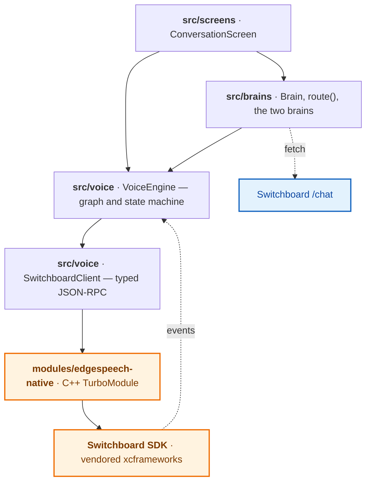

# Design notes

How the app works underneath, for anyone changing it rather than running it. The
[README](../README.md) covers getting it running and swapping the brain.

- [The native layer](#the-native-layer)
- [Installing the frameworks](#installing-the-frameworks)
- [The screen](#the-screen)
- [Turn taking](#turn-taking)
- [The persona](#the-persona)
- [What the prompt cannot do, and the code does](#what-the-prompt-cannot-do-and-the-code-does)
- [The two brains](#the-two-brains)
- [Going offline](#going-offline)
- [When things fail](#when-things-fail)
- [Conversation history](#conversation-history)

## The native layer

The native layer is deliberately tiny: one JSON-RPC string channel plus an event
stream. The entire audio graph — voice activity detection, transcription,
synthesis, barge-in — is authored in TypeScript above it, so changing the
pipeline never means touching native code.

`modules/edgespeech-native` and the vendored SDK are the only native pieces, and
only the first is code in this repo. The cloud brain touches neither: it is a
`fetch` and nothing more, which is why it still answers on a phone that has no
model on it.

## Installing the frameworks

`scripts/fetch-frameworks.js` downloads the SDK and extension xcframeworks into
`modules/edgespeech-native/ios/Frameworks/`. `postinstall` delegates to it, and
`npm run frameworks` runs it on its own. Each framework is stamped with the bucket
object's ETag once it lands, so a re-run fetches only what is missing or has
changed.

**The default channel is `develop`, a pre-release one.** The app needs the LLM
node's cancel action and its reply ceiling, and no release carries them yet — so
this is not a preference, and it does mean the frameworks can change under a fixed
version. `frameworks.lock.json` records the ETags this commit was tested against;
the stamps cannot, since the frameworks are not in git. When the bucket no longer
serves what the lock says, the fetch prints which packages moved and carries on
rather than stopping — an uninstallable sample is worse than one that tells you
what it is running. `SWITCHBOARD_UPDATE_LOCK=1 npm run frameworks` takes the new
build and refreshes the lock. Pointing `SWITCHBOARD_SDK_CHANNEL` at a release once
one carries those two features is the real fix.

| Variable                  | Effect                                                                    |
| ------------------------- | ------------------------------------------------------------------------- |
| `SWITCHBOARD_SDK_CHANNEL` | Bucket path to pull from. Defaults to `develop`.                          |
| `SWITCHBOARD_SDK_VERSION` | SDK version in the archive names. Defaults to `3.2.6`.                    |
| `SKIP_FRAMEWORK_DOWNLOAD` | Skip the download entirely. Used by CI's lint/typecheck/test job.         |
| `SWITCHBOARD_KEEP_ASSETS` | Keep every asset the packages ship, instead of stripping the unused ones. |
| `SWITCHBOARD_UPDATE_LOCK` | Record what was fetched in `frameworks.lock.json`.                        |

### Assets the fetch strips

CocoaPods embeds a vendored framework whole, so anything left in one reaches the
build whether the graph touches it or not. The fetch deletes three sets of files
straight after extracting, listed in `STRIPPED_ASSETS`:

- **The LLM extension's bundled Llama 3.2 1B GGUF**, 773 MB. `src/model` fetches
  it to the phone instead.
- **`HLG.fst` and the CTC model**, 388 MB. Both belong to `SherpaSTTNode`, and
  transcription here is `Whisper.STT`.
- **The `de_DE` voice**, 83 MB. `ttsVoice` is `en_GB`, so nothing selects it.

Together that takes the built app from roughly 1.63 GB to around 385 MB. Set
`SWITCHBOARD_KEEP_ASSETS` to keep them, which is what pointing the graph at
`Sherpa.STT` or the German voice needs.

## The screen

One screen, and one control: **Talk** opens the mic and every reply comes back
spoken. The transcript is the whole surface.

Each assistant turn carries the brain that answered it and the time that brain took
— `AI · On-device · 1.2 s` — coloured per brain, so switching mid-conversation shows
the difference rather than claiming it. The number is the brain's own measurement so
the two paths compare like for like; the round trip goes to the console as `[turn]`.
That, the `[LLM]` and `[Cloud]` lines each brain logs, and a `[net]` line whenever
the connection changes are the whole of the telemetry — there is no analytics
dependency. Connectivity is worth a line of its own because nothing else about it is
visible: a brain being withdrawn looks the same as one that was never picked.

The voice is never presented as a person: the header says so, and every reply is
labelled `AI`.

Badges, timings and interrupt markers are held alongside the transcript by index
rather than in it: both brains read that transcript, and neither produced a message
about itself.

## Turn taking

What ends a turn is silence, and nothing else. `Silero.VAD` scores frames of audio
and reports `speechEnded` after `vadSilenceMs` of quiet. The VAD has no idea what was
said, so a pause to think and the end of a sentence look identical to it.

Two numbers, both in `App.tsx`:

| Prop           | Default | What it holds                                                  |
| -------------- | ------- | -------------------------------------------------------------- |
| `vadSilenceMs` | 500     | Silence before the VAD calls the utterance over.               |
| `turnHoldMs`   | 350     | Silence after that, before Whisper is asked for what it heard. |

**The second wait sits in front of the transcription.** `speechEnded` does not reach
`sttNode.transcribe` through the graph; `VoiceEngine` makes the call, and speech
starting again inside the hold cancels it. So "What was the best thing… to visit in
Budapest?" is decoded once, as one sentence.

That ordering is what keeps the opening word of an utterance. `transcribe` reads
everything since the last call **and consumes it**, so a word alone in a short
segment would be decoded to nothing and thrown away, and the sentence would reach
the model starting from its second word. Holding the call leaves those words in the
window for the one that follows.

A pause long enough to survive the hold still splits the audio, and Whisper takes
long enough that the rest can be under way by the time the words come back. A
transcript that lands while the VAD is hearing speech waits for the rest and is
joined to it.

The waits add up: 850 ms is what the traveller waits after falling silent, and it is
also how long barge-in takes to register, since that fires on a decoded transcript
rather than on the VAD. Lower them for snappier replies and sentences split more
often. Tuning them wants a real phone and real speech.

The honest fix is a second stage that scores whether the utterance sounds finished,
rather than a longer wait that treats every pause the same.
[`openai-realtime-toolkit`](https://github.com/switchboard-sdk/openai-realtime-toolkit)
does that with a SmartTurn node behind the VAD, and the Switchboard SDK already
carries the extension.

## The persona

Three prompts, all in [`src/brains/types.ts`](../src/brains/types.ts): the rules
both brains are given, plus a set for each. What the two models can honestly say
differs — the one on the phone cannot look anything up and has nothing worth
trusting to say about a named place, while the cloud model is neither offline nor
short of knowledge. Each is told only what is true of it.

Shared are the rules about the shape of a spoken reply rather than what is behind
it: one or two sentences, no lists or verse, nothing it can book or phone, answer
the latest message. `systemPrompt()` numbers each set from 1, so a shared rule sits
wherever it reads best in `ON_DEVICE_SYSTEM_PROMPT` and `CLOUD_SYSTEM_PROMPT`
without either having to count.

The two sets pull in opposite directions, and that is the point of having two. The
on-device rules exist to stop a model inventing what it cannot know; the cloud rules
exist to stop one hedging over what it does. Asked what a day in Iceland costs, the
cloud is told to name a range and flag it as approximate, and to send the traveller
away to check only when the answer is genuinely live — today's price, whether
somewhere is open right now. Caution written for the smaller model is not caution on
the larger one, it is just an unhelpful answer.

The on-device set is written for the smaller model: numbered one-line rules rather
than a paragraph, and **every rule phrased as something to do**.

That last part matters more than it sounds. A rule that states the situation — "you
have no internet, no booking system and no live data" — buys nothing at this size; a
model acts on instructions and ignores descriptions. Hence refusing and redirecting
in one sentence rather than two rules, a general ban on invented specifics rather
than a list of examples to slip between, and no describing a named place, since the
prompt's own examples of who to ask are otherwise nouns to invent facts about.

Length is capped on both paths, and for different reasons. The chat endpoint applies
its own 200-token ceiling, which costs nothing because generating is not what a cloud
turn's wait is made of. On the device it is `maxTokens` on the node, set to 80 in
`App.tsx` — about twice what two spoken sentences need, and the traveller waits for
every token of it. Asked a broad question the model will answer with a list, and
`flattenMultilineReply` then drops everything past the first sentence, so a ceiling
roomy enough to hold the rest only buys a longer wait for words nobody hears.

Neither is a brevity control: a ceiling stops a reply wherever the count runs out,
usually mid sentence, and `OnDeviceBrain` trims the fragment back to the last full
stop. Rule 1 is what asks for short. The temperature is also lower than the
pipeline's default: rules only hold if the sampling is conservative enough to follow
them.

## What the prompt cannot do, and the code does

A direct **"write me a poem" produces verse** whatever the prompt says: a request in
the user's turn outranks a rule in the system prompt at this size. So the on-device
set has no rule about what to turn down at all. `OnDeviceBrain` decides that from
the reply the model actually wrote — verse being several lines with a sentence
carrying past the end of the first, which prose and lists never do — and says a
refusal instead of reading a line of poetry aloud.

Refusing from the reply rather than from the question is what keeps a travel question
from drawing the refusal. A rule has to guess in advance what a request is; the code
can see what came back.

Two more things happen to a refusal on the way out, both for the same reason: a fixed
sentence the model has just written is the likeliest thing for it to write next, and
two in a row make it the answer to everything. So a refusal is **said a different way**
each time, and is **kept out of the replay**, so the node never reads it back. See
[Conversation history](#conversation-history) for what the second costs.

Neither habit shows up on the cloud path.

## The two brains

Speech recognition and synthesis are always on the device. The only thing that
swaps is what answers, and both answerers implement the same interface — see
[Swapping the brain](../README.md#swapping-the-brain) in the README for the
interface itself and how to add a third.

Neither owns the conversation — the transcript is handed in on every turn — so
swapping brains mid-conversation carries the context across rather than starting
over. A reply comes back saying which brain produced it and how long it took, so
a turn can be labelled with both.

`OnDeviceBrain` wraps the `LlamaCpp.LLM` node. Because that node takes a single
string rather than a list of turns, a replayed conversation has its roles spelled
out in the prompt text — which makes it look like a transcript, and a 1B model will
carry on writing one rather than answering. So the replay fences the history off as
background and ends on an instruction, and a reply that still opens with a role
label has it stripped before it reaches the transcript or the speaker.

It also flattens a reply that arrives as verse or a list to its first line or
sentence. The prompt forbids both, but a direct request outranks it at this model
size and the speaker reads every line it is given; a reply that obeys the prompt has
no line breaks, so nothing legitimate is lost.

It also drops a trailing half-sentence. A reply can be cut off rather than finished
— the node's `maxTokens` ceiling stops wherever the count runs out — and half a
sentence read aloud sounds like a fault rather than a short answer. A reply that
never reached a sentence end is kept whole: a fragment still beats saying nothing.

`CloudBrain` posts to Switchboard's chat endpoint, which takes the transcript as it
is — the roles the app already tracks are the roles it expects — and answers with
text alone, never naming the model behind it. On top of that it handles what a
network needs: a 15-second timeout, one retry on a timeout, a dropped connection or
a 5xx, and prompt cancellation when the user interrupts. A rate limit is the
exception it does not retry, for the reason in
[Cloud credentials](../README.md#cloud-credentials).

The endpoint forwards only the last 12 messages, so `CloudBrain` trims the
transcript to 10 rather than letting the system prompt be the message that falls
off the front. Replies are buffered, so there is no cloud equivalent of the
on-device token stream.

The endpoint-specific parts are
`buildRequest`, `parseReply` and `parseError` at the top of `CloudBrain.ts` — those
three functions and two constants are the whole of what changes to point it
somewhere else.

The transcript holds only what was actually said. An interruption is recorded
against the reply it cut off rather than added as a turn of its own — a message
reading `[interrupted]` would be a turn neither brain ever produced, and it would
put the on-device node permanently one message behind.

**Cancelling a turn** stops the work on both paths. The cloud request is aborted;
the on-device node stops within a token and drops the reply it was building,
keeping the conversation. Either way the transcript is left holding what the user
said with no answer to it, which is a state the next turn continues from normally
— so interrupting costs nothing beyond the reply you chose not to hear.

## Going offline

The cloud brain is the only part of the app that needs a connection, so losing one
withdraws it rather than leaving it to fail: `useOnline` in
[`src/connectivity.ts`](../src/connectivity.ts) follows the OS's own network state,
`route` refuses to hand out a brain that declares `requiresNetwork` while there is
none, and the picker dims it. An unknown state counts as connected — only a definite
answer takes a brain away.

Because the OS reports the change, airplane mode registers the moment it is switched
on rather than on the next request. If it lands while the cloud is mid-turn, that
turn is abandoned and its question asked again on the device, so the conversation
carries on instead of producing an error about a request that was never going to
arrive.

The app also says so out loud, which is the point of it: _"You're offline now. I'll
answer on this phone, so a reply may take a moment."_ The reply that follows queues
behind the notice rather than cutting it off — the TTS node plays what it is given in
order — so the notice is heard whole and the wait it warns about is the reply being
generated. It stays quiet in two cases: with no conversation in progress, where an
announcement is the app talking to itself, and for someone already on the on-device
brain, who loses nothing worth talking over their reply for. The pick itself is kept
either way, so the cloud answers again on its own once the connection returns.

What gets picked up comes from the transcript — a question with no answer under it —
rather than from whatever turn was in flight. By the time the OS reports the change
the request may already have died, or never started because the words were still
being transcribed, and in both cases the question is still there to answer.

## When things fail

Every failure lands in one place: a banner under the header, with an action where
one exists — Settings for a microphone the user has denied, the other brain when
the selected one cannot answer. [`src/errors.ts`](../src/errors.ts) is the only
file that turns an error code into a sentence, so a new failure has one obvious
home, and an unrecognised code keeps its own message rather than being flattened
into an apology.

Two of the six cases needed more than wording.

**A turn the model never answers.** The `LlamaCpp.LLM` node abandons a turn in
silence in several cases — no model loaded, or a prompt it could not measure,
template, tokenise or decode — and has no error event it could send even in
principle, while the `prompt` action returns success either way. Nothing
distinguishes a dead model from a slow one but silence, so `VoiceEngine` watches for
the first streamed token: it arrives within seconds when the model is running, and
its absence ends the turn early. The full reply keeps the longer budget, so a slow
generation is unaffected.

**Synthesis that never finishes.** `speak()` has no other bound, and a `finished`
event that never arrives would leave the state machine in `speaking` for the rest of
the session — after which the next thing the user says is read as barge-in and
stamps the previous turn `interrupted`. There is a watchdog on that too.

Missing credentials get a screen of their own. The provider throws when the app ID
or secret is absent, which is a fair contract guard but nothing here catches a
render throw, so `App.tsx` checks first and shows what to set.

## Conversation history

**App state is the source of truth.** The `LlamaCpp.LLM` node also keeps its own
rolling context, evicting the oldest exchanges when the context fills, but that
context is opaque — it cannot be read, and there is no way to append a past turn
without the model generating a reply to it. The only reset it offers is writing
the `instructions` property, which clears the history deliberately.

So the two are kept in step by tracking how many messages the node has ingested:

- **In sync** — the usual case — a turn sends only the new user message, so the
  node keeps its cache warm and the reply comes back fast.
- **Diverged** — the node and the transcript disagree, because a cloud reply
  landed or the brain was switched mid-conversation — the node is reset and the
  conversation is replayed as a single prompt.

That costs one re-prefill at the moment of a switch and nothing during a normal
exchange. It is also what lets a switch keep context: both brains read and write
the same transcript, so flipping mid-conversation continues rather than restarts.

**One exception, and it is deliberate.** A replay leaves out any exchange the model
refused — the refusal and the request that drew it — so the transcript on screen and
the transcript the node reads are not quite the same. A refused turn also counts as
a divergence, which is what forces the replay that drops it. So the node's own
context holds a refusal for exactly one turn and never reads it back, at the price of
one re-prefill each time. The screen keeps both, because the traveller heard both.
[What the prompt cannot do, and the code does](#what-the-prompt-cannot-do-and-the-code-does) is
why this is worth an exception at all.
